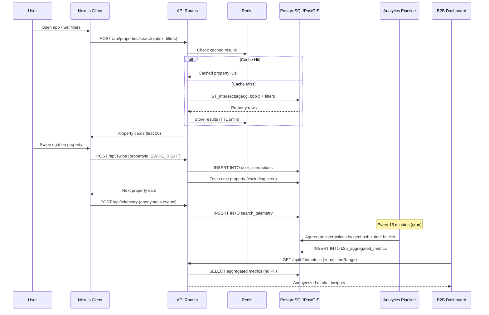
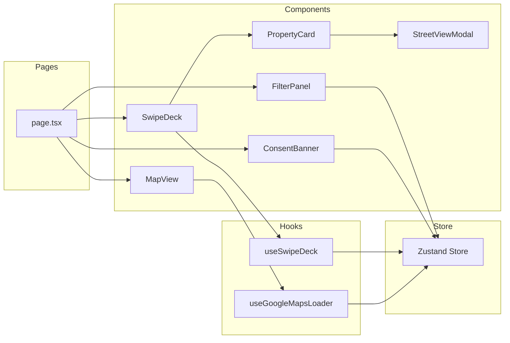

# PropFind System Architecture

## High-Level System Diagram

```mermaid
graph TB
    subgraph Client["Client (Browser)"]
        A[Next.js App Router]
        B[Swipe Deck + Framer Motion]
        C[Lazy Google Maps]
        D[Zustand Store]
        E[Analytics Consent Banner]
    end

    subgraph Edge["Edge Layer"]
        F[Next.js Middleware<br/>Rate Limiting + Auth]
        V[CDN / Vercel Edge]
    end

    subgraph API["API Layer (Route Handlers)"]
        G[/api/properties/search]
        H[/api/swipe]
        I[/api/telemetry]
        J[/api/user/filters]
        K[/api/properties/:id/street-view]
        L[/api/b2b/metrics]
    end

    subgraph Services["Service Layer"]
        M[Property Service]
        N[Swipe Service]
        O[Telemetry Service]
        P[GeoService]
        Q[B2B Analytics Service]
    end

    subgraph Data["Data Layer"]
        R[(PostgreSQL + PostGIS)]
        S[(Redis Cache)]
        T[(S3 / Object Storage)]
    end

    subgraph External["External APIs"]
        U[Google Maps JavaScript API]
        V2[Google Street View API]
        W[Google Geocoding API]
    end

    subgraph B2B["B2B Reporting"]
        X[Aggregated Metrics Pipeline]
        Y[Developer Dashboard]
        Z[CSV/JSON Export]
    end

    A --> B & C & D & E
    A --> F
    F --> G & H & I & J & K & L
    G --> M
    H --> N
    I --> O
    K --> P
    L --> Q
    M --> R & S
    N --> R
    O --> R
    P --> R & S
    Q --> R
    C --> U & V2
    P --> W
    M --> T
    R --> X
    X --> Y & Z
```

## Data Flow: Client → Geospatial DB → Analytics → B2B



## Component Interaction Flow



## Service Responsibilities

| Service | Responsibility |
|---------|---------------|
| **Property Service** | Geospatial queries, bounding box search, property CRUD |
| **Swipe Service** | Record interactions, manage seen-property deduplication, queue next cards |
| **Telemetry Service** | Ingest anonymous events, validate consent, batch-write to DB |
| **GeoService** | PostGIS helpers, GeoJSON generation, distance calc, geocoding cache |
| **B2B Analytics Service** | Aggregate metrics pipeline, serve anonymized insights |

## Infrastructure Notes

- **Vercel Edge** for global low-latency API routing
- **Supabase** or **Railway** for managed PostgreSQL + PostGIS
- **Upstash Redis** for serverless-compatible caching
- **Google Cloud** for Maps API with billing alerts
- **Cron job** (Vercel Cron or GitHub Actions) for B2B aggregation every 15 min
