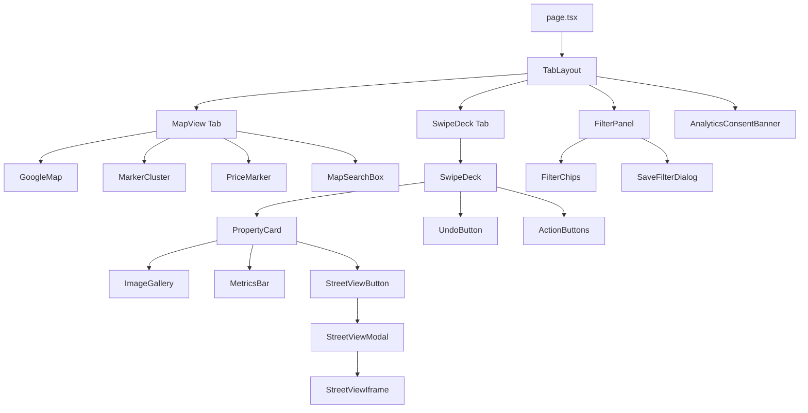

# Frontend Component Architecture

## Component Tree



## Swipe Deck State Management (Zustand)

```typescript
// Core state shape
interface AppState {
  // Card queue
  currentProperty: Property | null;
  swipeQueue: Property[];          // Pre-fetched next cards
  discardedHistory: string[];      // Property IDs already seen
  undoStack: UndoEntry[];          // For undo functionality

  // Filters
  activeFilter: FilterCriteria;
  savedFilters: SavedFilter[];

  // Session
  userSession: {
    sessionId: string;
    userId?: string;
    isAuthenticated: boolean;
  };

  // Consent
  analyticsConsent: boolean;

  // Actions
  swipe: (direction: SwipeDirection) => void;
  undo: () => void;
  prefetchNext: () => void;
  setFilter: (filter: FilterCriteria) => void;
  saveFilter: (name: string) => void;
  setAnalyticsConsent: (consent: boolean) => void;
}
```

## Lazy-Loaded Google Maps Integration

```
User clicks "Map View" tab
  → useGoogleMapsLoader detects tab activation
  → Dynamic import of @googlemaps/js-api-loader
  → Load Maps JavaScript API with session token
  → Initialize map only when container is in viewport (IntersectionObserver)
  → Street View NEVER loads until user clicks "Street View" button on a card
```

## Framer Motion Swipe Gesture Handlers

```typescript
// Key patterns:
const controls = useAnimation();

// Drag constraints for natural feel
const dragConstraints = { left: -300, right: 300, top: 0, bottom: 0 };

// Velocity-based swipe detection
const handleDragEnd = (_: any, info: PanInfo) => {
  const threshold = 100;
  const velocity = info.velocity.x;
  const offset = info.offset.x;

  if (offset > threshold || velocity > 500) {
    // Swipe right → like
    controls.start({ x: 1000, opacity: 0, transition: { duration: 0.3 } });
    onSwipe('right');
  } else if (offset < -threshold || velocity < -500) {
    // Swipe left → pass
    controls.start({ x: -1000, opacity: 0, transition: { duration: 0.3 } });
    onSwipe('left');
  } else {
    // Snap back
    controls.start({ x: 0, y: 0, rotate: 0 });
  }
};
```

## Pre-fetching Strategy

```
Current card displayed
  → Queue has cards [current, +1, +2, +3]
  → When user swipes current card:
    1. Move +1 to current
    2. Trigger API fetch for +4
    3. Append to queue
  → Queue always maintains 3 cards ahead
  → API call: POST /api/properties/search?exclude=[seenIds]&limit=1
```

## 60 FPS Optimization Notes

1. **CSS Transforms Only**: Use `translate3d()`, `rotate()`, `scale()` — never animate `top`/`left`/`width`
2. **GPU Acceleration**: `will-change: transform` on card elements
3. **Compositor-Only Properties**: Only `transform` and `opacity` in animations
4. **Avoid Layout Thrashing**: Batch DOM reads/writes
5. **Passive Event Listeners**: `{ passive: true }` on touch/pointer events
6. **requestAnimationFrame**: All JS-driven animations use rAF
7. **Image Optimization**: Next.js `<Image>` with `priority` on current card, `loading="lazy"` on queue cards
8. **Virtualization**: Only render current + 2 adjacent cards in DOM

```css
/* Critical CSS for 60 FPS */
.property-card {
  will-change: transform;
  transform: translate3d(0, 0, 0);
  backface-visibility: hidden;
  perspective: 1000px;
}
```

## Keyboard/Button Fallbacks

| Input | Action |
|-------|--------|
| Arrow Left | Swipe left (pass) |
| Arrow Right | Swipe right (like) |
| Arrow Up | Superlike |
| Z | Undo last swipe |
| S | Save property |
| Escape | Close modal |

On-screen buttons mirror all swipe actions for accessibility.

## Undo Mechanism

```
Undo Stack (max 10 entries):
  Each entry: { propertyId, interactionType, previousQueueState }

On undo:
  1. Pop from undoStack
  2. Remove interaction from DB (soft delete)
  3. Restore property to top of queue
  4. Animate card sliding back from swipe direction
  5. Show toast: "Undo successful"

Undo expires after 10 seconds (visual countdown on button)
```
